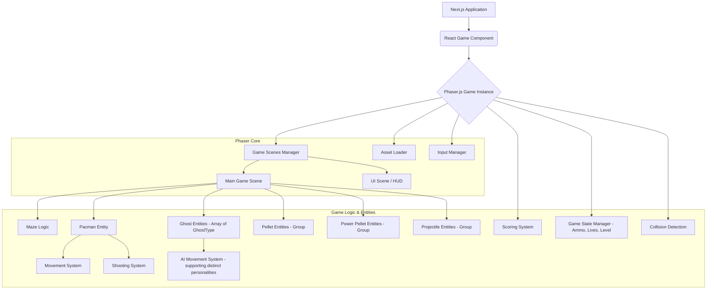

# Pac-Man Game Development Plan (v1)

This plan outlines the development of a Pac-Man game with shooting mechanics, as per the requirements in [`docs/test_requests/pacman.md`](docs/test_requests/pacman.md).

**Status: Phase 1 Completed. Next up: Phase 2, Step 1 (Pellet Implementation).**

## 1. Project Setup & Core Technologies

* **Framework:** Next.js
* **UI Components:** shadcn/ui
* **Styling:** Tailwind CSS
* **Icons:** Lucid Icons (for UI elements outside the game canvas, if any)
* **Language:** TypeScript
* **Game Engine:** Phaser.js (integrating with a Next.js component)
* **State Management (Game):** Start with Phaser's built-in state management. If complexity grows significantly, consider Zustand (lightweight) or Redux (more robust, if needed for complex global game state interacting heavily with React UI). For MVP, Phaser's capabilities should suffice.
* **State Management (Next.js App):** React Context or Zustand for any application-level state outside the game canvas.

## 2. Game Architecture & Key Modules

**Key Modules/Components:**

1. **`GameContainer` (React Component):**
   * Hosts the Phaser game canvas.
   * Manages the lifecycle of the Phaser game instance.
   * Potentially bridges communication between React UI elements (e.g., score display if outside canvas) and the Phaser game.
2. **Phaser Game Scenes:**
   * **`BootScene`:** Loads essential assets for the loading screen.
   * **`PreloadScene`:** Loads all main game assets (sprites, audio, tilemaps). Displays a loading bar.
   * **`MainMenuScene`:** Game title, start button, options.
   * **`GameScene`:** The main gameplay area.
     * Maze rendering and collision (Classic Pac-Man layout).
     * Pac-Man creation, movement, and shooting.
     * Ghost creation, AI movement (distinct personas), and respawn logic.
     * Pellet and power pellet management.
     * Projectile management.
     * Collision detection and handling.
     * Score and game state updates.
   * **`UIScene` (HUD):** Displays score, lives, ammo count. Runs in parallel with `GameScene`.
   * **`GameOverScene`:** Displays game over message, final score, restart option.
3. **Entity Classes (TypeScript):**
   * **`Pacman`:**
     * Properties: position, speed, direction, lives, ammo, score.
     * Methods: `move()`, `shoot()`, `handleCollision()`, `collectPellet()`, `powerUp()`.
   * **`Ghost`:**
     * Properties: position, speed, direction, state (chase, flee, eaten, respawning), `persona` (e.g., 'Blinky', 'Pinky', 'Inky', 'Clyde') determining AI behavior.
     * Methods: `move()`, `handleCollision()`, `respawn()`, `setVulnerable()`, `updateAI()`.
   * **`Pellet` / `PowerPellet`:**
     * Properties: position, type, points.
   * **`Projectile`:**
     * Properties: position, speed, direction.
     * Methods: `move()`, `handleCollision()`.
   * **`Maze`:**
     * Handles tilemap loading (classic layout), layer setup (walls, pellets).
     * Provides collision information.
     * Methods: `getTileAt(x, y)`, `isWall(x, y)`.
4. **Systems/Managers (TypeScript classes or modules within Phaser scenes):**
   * **`MovementSystem`:** Handles player input and updates Pac-Man's position, ensuring maze boundary adherence.
   * **`ShootingSystem`:** Handles projectile creation, cooldown, ammo count.
   * **`GhostAISystem`:** Controls ghost movement patterns. Will include logic to differentiate behavior based on `Ghost.persona` (e.g., Blinky directly chases, Pinky tries to get in front, Inky is more unpredictable, Clyde is random/cowardly when Pac-Man is close).
   * **`CollisionSystem`:** Uses Phaser's physics or arcade physics to detect collisions.
   * **`ScoreSystem`:** Tracks and updates the player's score.
   * **`GameStateSystem`:** Manages lives, ammo, current level, difficulty progression, ghost respawn timers.
   * **`AssetManager`:** (Handled by `PreloadScene`) Loads and provides access to sprites, audio (generic 8-bit style).
   * **`InputManager`:** (Handled by Phaser scenes) Captures keyboard inputs for movement and shooting.

## 3. Development Phases & Milestones

### **Phase 1: Core Setup & Pac-Man Movement (Priority: Core Movement)**

1. **~Project Initialization:~**
   * ~Set up Next.js project with TypeScript.~
   * ~Install Tailwind CSS and shadcn/ui.~
   * ~Install Phaser.js.~
2. **~Basic Phaser Integration:~**
   * ~Create the `GameContainer` React component.~
   * ~Initialize a simple Phaser game instance within it.~
   * ~Set up `BootScene`, `PreloadScene`, and an initial `GameScene` (and verified basic scene transition).~
3. **~Maze Implementation:~**
   * ~Use a classic Pac-Man maze layout (via Tiled map or 2D array).~
   * ~Load and render the maze in `GameScene`.~
   * ~Implement wall collision.~
4. **~Pac-Man Asset & Basic Entity:~**
   * ~Source/create Pac-Man sprite (used simple graphic for now).~
   * ~Create `Pacman` entity class.~
   * ~Render Pac-Man.~
5. **~Pac-Man Movement:~**
   * ~Implement keyboard controls.~
   * ~Ensure movement respects wall collisions.~
   * ~Basic Pac-Man animation (deferred actual sprite animation).~

### **Phase 2: Pellets, Scoring & Ghosts**

1. **Pellet Implementation & Initial Pac-Man Adjustments:**
   * Create `Pellet` entity. (`DONE`)
   * Populate maze with pellets. (`DONE`)
   * Implement collection, scoring. (`DONE`)
   * Display score in `UIScene` (temporarily in `GameScene`). (`DONE` - basic display)
   * Adjust Pac-Man sprite to use SVG and refine size/rotation. (`DONE`)
2. **Ghost Assets & Basic Entities:**
   * Source ghost icons (Noun Project), scale appropriately.
   * Create `Ghost` entity class with `persona` property.
   * Render ghosts with distinct personas.
3. **Basic Ghost AI (with Persona Differentiation):**
   * Implement distinct movement for each persona in `GhostAISystem`.
     * *Blinky (Red):* Direct chase.
     * *Pinky (Pink):* Attempts to position ahead of Pac-Man.
     * *Inky (Cyan):* More complex/unpredictable pattern (simplified for MVP if needed).
     * *Clyde (Orange):* Chases from afar, retreats when close.
   * Implement ghost-wall collision.
4. **Pac-Man/Ghost Collision (Losing a Life):**
   * Detect Pac-Man/ghost collision.
   * Pac-Man loses a life.
   * Reset Pac-Man's position.
   * Implement and display lives system.

### **Phase 3: Power-Ups & Shooting Mechanics**

1. **Power Pellets:**
   * Create `PowerPellet` entity.
   * Add to maze.
   * On collection: ghosts become vulnerable, Pac-Man can eat ghosts, timer starts.
2. **Eating Ghosts:**
   * On collision with vulnerable ghost: ghost "eaten", points awarded, ghost enters respawn state.
3. **Shooting Prerequisite (Ammo Collection):**
   * Gain 1 ammo per 50 regular pellets. Max 3 ammo.
   * Display ammo in `UIScene`.
4. **Shooting Implementation:**
   * Shoot action (space bar).
   * Create `Projectile` entity.
   * Projectile moves at 10x Pac-Man speed.
   * 1-second cooldown. Consumes 1 ammo.
5. **Projectile Collision:**
   * With walls: projectile destroyed.
   * With ghost: ghost "dies", points awarded, ghost enters respawn state.

### **Phase 4: Ghost Respawn & Game State Refinements**

1. **Ghost Respawn Mechanics:**
   * Respawn at fixed location after delay (initially 10s, decreases with difficulty).
   * Post-respawn: vulnerable for a few seconds (duration decreases with difficulty).
2. **Game State Management:**
   * Detailed score tracking.
   * Ammo transferable between levels (future).
   * Game over (0 lives).
   * Level complete (all pellets eaten - future).
3. **Difficulty Progression (Basic):**
   * Gradual increase in challenge (e.g., ghost speed, reduced timers).

### **Phase 5: UI, Assets, and Polish**

1. **Icon Integration & Animation:**
   * Integrate Noun Project icons for Pac-Man and Ghosts.
   * Implement simple animations (sprite sheets or frame changes).
   * Visual style: Keep It Simple, Stupid (KISS) for MVP, with a clean, modern retro feel.
2. **UI Refinement:**
   * Improve HUD.
   * Implement Main Menu and Game Over screens.
3. **Sound Effects (Simplest Options):**
   * Add generic 8-bit style sound effects for key actions.
4. **Testing and Bug Fixing.**

## 4. Key Technical Considerations

* **Phaser in Next.js:** Best practices for integration (dynamic imports, lifecycle management).
* **Asset Pipeline for Noun Project Icons:** Download (SVG/PNG) and process for Phaser (manual for MVP).
* **Maze Design:** Classic Pac-Man layout.
* **Ghost AI Complexity:** Implement distinct personas from Phase 2.
* **Performance:** Monitor, especially with multiple entities.

## 5. Key Notes & Learnings from Phase 1

* **Project Setup:**
  * Next.js project (`pacman-game`) initialized successfully with TypeScript, Tailwind, ESLint, App Router, `src` directory, and `@/*` import alias using `npx create-next-app@latest ... --yes`.
  * Phaser.js installed via `npm install phaser`.
  * `shadcn/ui` initialized using `npx shadcn@latest init -y` (note: `shadcn-ui` is deprecated). Selected "Neutral" base color and used `--force` for React 19 peer dependencies.
* **Phaser Integration & Debugging:**
  * Initial attempts to run the Phaser game encountered issues with scene transitions and HMR.
  * **Phaser Imports:** Corrected Phaser imports from `import Phaser from 'phaser'` to `import * as Phaser from 'phaser'` in all relevant files (`GameContainer.tsx`, `BootScene.ts`, `PreloadScene.ts`, `GameScene.ts`).
  * **`next/dynamic` in Server Components:** Added `'use client';` to `pacman-game/src/app/page.tsx` to resolve issues with using `ssr: false` for the dynamically imported `GameContainer` component.
  * **Scene Transition Debugging:**
    * Systematic logging was added to scene lifecycle methods (`preload`, `create`) and after `this.scene.start()` calls to trace execution.
    * Temporarily simplified `PreloadScene` and started `GameScene` directly from `GameContainer` to isolate issues. This confirmed `GameScene` could run.
    * The root cause of scene transition failure from `BootScene` to `PreloadScene` appeared to be related to an overly aggressive HMR fix in `GameContainer.tsx` that was destroying the game instance prematurely. Reverting this specific HMR logic while keeping the standard `useEffect` cleanup resolved the transition.
  * **`GameContainer.tsx`:** The `useEffect` hook was refined to correctly manage the Phaser game instance lifecycle, especially concerning HMR.
  * **TypeScript Errors:** Addressed minor TypeScript errors, such as ensuring `gravity` in physics config had both `x` and `y`, and renaming a `Pacman.stop()` method to `Pacman.stopMovement()` to avoid conflict with the base Sprite class. Corrected an undefined variable `S` in the maze layout by replacing it with `0`.
* **Current Status (End of Phase 1):**
  * Basic Next.js app structure is in place.
  * Phaser game canvas is rendering.
  * Scene transition (`BootScene` -> `PreloadScene` -> `GameScene`) is working.
  * A static maze is rendered using a 2D array and Phaser graphics.
  * A Pac-Man entity (yellow circle) is rendered and can be moved with arrow keys.
  * Pac-Man correctly collides with maze walls.
* **Post-Phase 1 / During Phase 2 Adjustments (User Feedback):**
  * **Pac-Man Sprite:** Updated to use `pacman-icon.svg` loaded via `PreloadScene`.
  * **Pac-Man Size:** Adjusted to 20x20 pixels (visual) with a ~19x19 physics body to better fit maze tiles.
  * **Pac-Man Rotation:** Implemented rotation based on movement direction in `Pacman.ts` entity methods.
  * **Pac-Man Movement (Turning):** Refactored movement logic in `Pacman.ts` and `GameScene.ts` to implement a lenient turning system (queued intentions, turning at tile centers with wall checks) for improved playability.
  * **Game Area/Camera:** Adjusted game canvas dimensions in `GameContainer.tsx` to match the maze size (560x620 pixels), eliminating empty "black" zones.
  * **Pac-Man Edge Wrapping:** Implemented world wrapping for Pac-Man in `Pacman.ts` to create a tunnel effect (basic general wrap for now).
  * **Physics Debug Visuals:** Disabled physics debug graphics in `GameContainer.tsx` to remove the green movement direction line.
  * **SVG Asset Handling:** Encountered issues with `write_to_file` tool for `pacman-icon.svg`, requiring manual placement of the file. The game was temporarily reverted to use a dynamic circle for Pac-Man during debugging. After manual SVG placement, code was updated to use the SVG.
